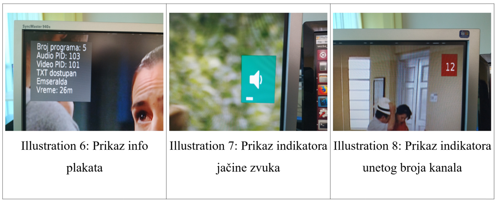
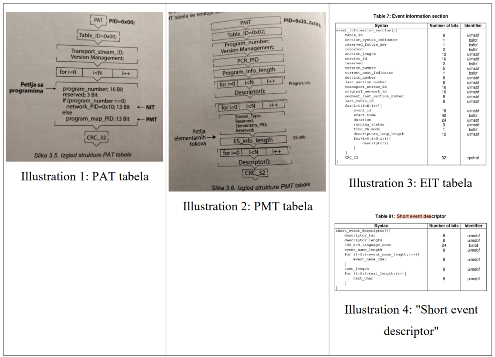
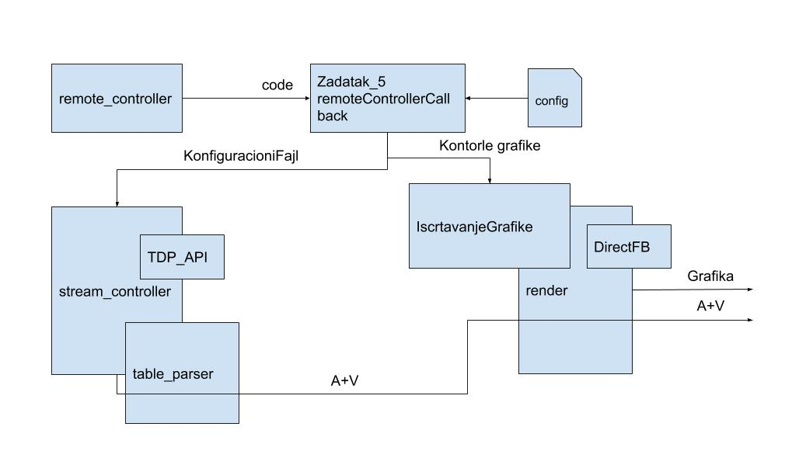

```text
Univerzitet u Novom Sadu
Fakultet tehničkih nauka
Računarska tehnika i računarske komunikacije
```

## Programska podrška u televiziji i obradi slike 1

### Aplikacija za TV prijemnik



#### Uvod

Ispitni zadatak na predmetu programska podrška u televiziji i obradi signala 1 se sastoji od izrade aplikacije za TV prijemnik za namenski procesor `Marvell Armada`. Cilj je upoznati se sa načinom funkcionisanja digitalne televizije i korisniku omogućiti da neometano prati program.

Korisniku je potrebno omogućiti osnovne funkcionalnosti poput promene i odabira željenog kanala, pojačavanjaismanjivanja jačine zvuka, prikazivanja informacije o imenu trenutnog događaja kao i vremenu trajanja događaja.

Za rešavanje zadatka koristili smo `TDP API` (tuner, demultiplexer, player) za obradu dolazećeg toka i `DirectFB` (Direct frame buffer) biblioteku za iscrtavanje grafike.

#### Prenosni tok

`MPEG` prenosni tok (`TS`) je standard za paketski prenos zvučnih, video i informacionih podataka. Primenu pronalazi za prenos digitalnih sadržaja na cvrstim medijumima poput digitalnih video diskova (`DVD`) kao i za terestrijalno i satelitsko difuzno emitovanje.

Jedan glavni tok sadrži pakete elementarnog toka koji se emituju određenom brzinom. Svaki od paketa sadrži određenu informaciju. Na osnovu identifikatora saznajemo da li se radi o paketu zvuka, videa ili neke druge informacije poput teleteksa, titla ili elektronskog vodiča. Svaki paket prenosi tabelu koja sadrži zaglavlje i podatke u zavisnosti od podatka koji prenosi, koja je definisana standardom.

`PAT` je osnovna u organizaciji digitalnog prenosnog toka i prenosi se sa PID vrednošću nula (`PID = 0x0`). Svrha ove tabele je da obezbedi identifikaciju svih program koji se emituju.

Tabel programa `PMT` obezbeđuje povezivanje jednog programa u prenosnom toku. Postoji tačno jedna `PMT` tabela za svaki program koji se nalazi u okviru prenosnog toka. Period emitovanja ove tabele je oko pola sekunde. Identifikacija ove tabele je dva (`table_ID = 2`).

Tabela sa opisom emisija (`EIT`) sadrži informacije o emisijama koje se emituju na određenom programu u određenom vremenskom intervalu. Tabela "present/following" nosi informaciju o emisijama koje se trenutno emituju. `PID` vrednost ove tabele je dvanaest (`PID = 0x12`).



#### Koncept rešenja

Rešenje se zasniva na upotrebi rukovalaca koji rade u zasebnim nitima. Rukovaoci obrađuju ulazne podatke poput toka podatak (`MPEG TS`) ili kodova tipki prilikom upotrebe daljinskog upravljača, i daju izlazne podatke za iscrtavanje grafike.



#### Rukovalac grafike

Sistem od korisnika prima zahtev preko daljinkog upravljača. Prilikom reagovanja na zahtev, poziva se neka od funkcija koja postavlja indikator da je neophodno prikazati prikladnu grafičku interpretaciju. Za to vreme, nit "render" proverava koji je indikator označen i na osnovu njega upotrebom direkt frejm bafera (Direct Frame Buffer) se iscrtava grafika na ekran.

Takođe, prilikom svakog postavljanja indikatora aktivira se tajmer koji broji tri sekunde od kada je indikator postavljen. Nakon što tajmer otkuca tri sekunde, poziva se funkcija koja uklanja indikator i tako prestaje prikazivanje grafičke interpretacije.

#### Rukovalac daljinskim upravljačem

Ovaj rukovalac prima signal i obrađuje signal pristiga od strane korisnika upotrebom daljinskog upravljača. Polja koja rukovalac obrađuje su, kod poruke (identifikator tipke) i stanje pritisnutosi (taster pušten, pritisnut ili stisnut).

#### Rukovalac tokom podataka

Rukovalac tokom u svom radu se oslanja na `TDP API` koji mu omoguđuje postavljanje filtera za prijem paketa i prelazak u memorisjki režim rada demultipleksera, štimovanje (`tuning`) na određenu frekvenciju emitovanja toka, kao i rad sa plejerom za reprodukciju i rad sa jačinom zvuka.

### Skraćenice

| Skraćenica | Značenje |
| - | - |
| TV | Television, Televizija |
| API |Application Programming Interface, Interfejs za programiranje aplikacija |
| MPEG | Moving Picture Experts Group |
| TS | Transport Stream |
| PAT | Program Allocation Table |
| PMT | Program Map Table |
| EIT | Event Information Table |

